# RangeViT-Fusion: Mid-term Progress Report

## Presentation Materials

**Duration:** 20-30 minutes
**Audience:** Thesis advisor (knows CV deeply, knows RangeViT, not familiar with HARP-NeXt)
**Purpose:** Mid-term thesis progress report

---

## Slide 1: Title

**Title:** RangeViT-Fusion: Integrating Bidirectional Point-Pixel Fusion into Vision Transformers for LiDAR Semantic Segmentation

**Subtitle:** Mid-term Progress Report

**Your name, Advisor name, Institution, Date**

---

## Slide 2: Motivation & Problem

**Slide Title:** The Gap in Range Image Methods

**Key Points:**
- Range image projection enables efficient 2D processing of LiDAR point clouds
- Current ViT-based methods (RangeViT) process only in 2D pixel space
- **Problem:** 3D geometric information is lost during projection
- Points that are spatially distant in 3D can become neighbors in 2D
- Post-hoc 3D refiners (KPConv) are expensive and disconnected from encoder

**Diagram - The Projection Problem:**

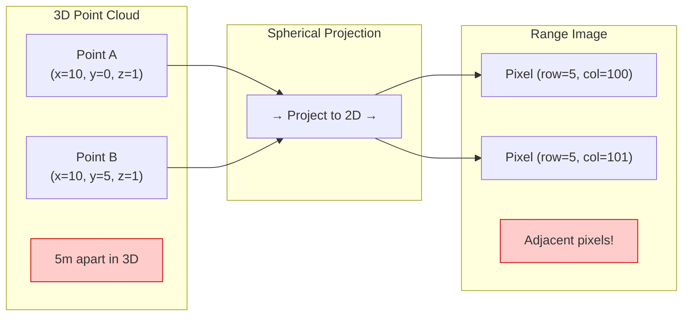

**Diagram - Current Pipeline Limitation:**

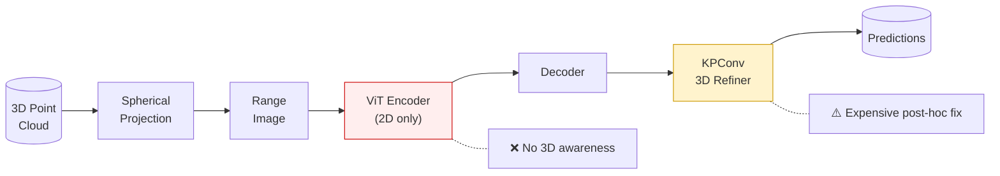

**Talking Points:**
> "While RangeViT achieves strong results by applying Vision Transformers to range images, there's a fundamental limitation: the 2D encoder operates entirely in pixel space and has no awareness of the underlying 3D geometry. Two points that are 10 meters apart in 3D could end up as neighboring pixels due to the spherical projection. Current solutions apply 3D refinement after the encoder, but this is computationally expensive and the encoder never benefits from 3D information during feature learning."

---

## Slide 3: RangeViT Recap

**Slide Title:** RangeViT: ViT for Range Image Segmentation (CVPR 2023)

**Key Points:**
- Adapts Vision Transformer for range image semantic segmentation
- ConvStem for patch embedding (better than linear projection)
- Pretrained on ImageNet, fine-tuned for LiDAR
- Optional KPConv post-processor for 3D refinement
- State-of-the-art on nuScenes and SemanticKITTI

**Diagram - RangeViT Architecture:**

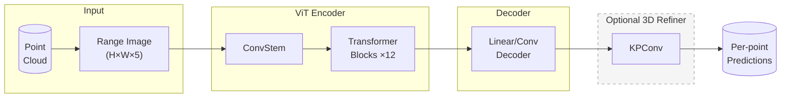

**Talking Points:**
> "As you know, RangeViT projects LiDAR points to a range image and processes it with a Vision Transformer. The ConvStem handles patch embedding, 12 transformer blocks extract features, and a decoder produces pixel-wise predictions. These are then mapped back to points. Optionally, KPConv refines predictions in 3D. The key limitation I'm addressing: the ViT encoder has no knowledge of 3D structure during processing."

---

## Slide 4: HARP-NeXt Key Insight

**Slide Title:** HARP-NeXt: Bidirectional Point-Pixel Fusion

**Key Points:**
- Maintains **parallel branches**: pixel features AND point features
- **Continuous fusion** throughout the network, not just at the end
- At each fusion point:
  - Pixel → Point: map 2D features to 3D locations
  - Point → Pixel: aggregate 3D features back to 2D grid
- Result: Both branches benefit from each other's information
- No need for expensive post-hoc 3D refinement

**Diagram - Bidirectional Fusion Concept:**

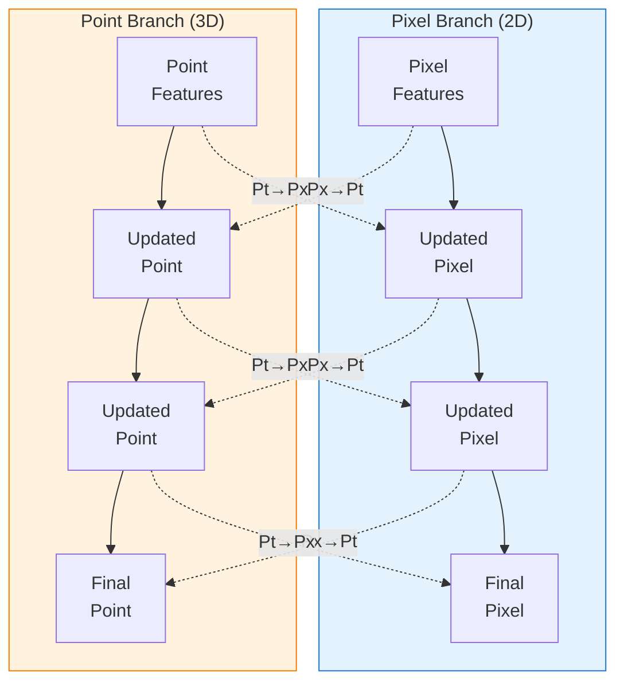

**Diagram - Single Fusion Operation:**

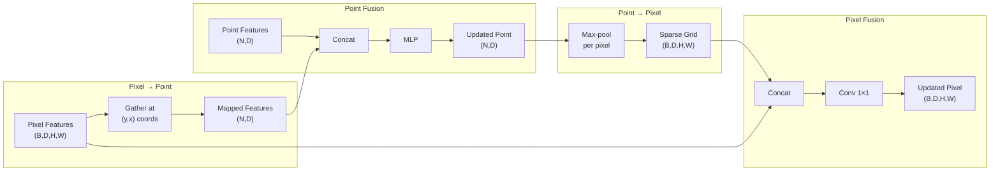

**Talking Points:**
> "HARP-NeXt's key insight is maintaining two parallel branches throughout the network - one for 2D pixel features and one for 3D point features - with continuous bidirectional fusion. At each fusion point, pixel features are gathered at point locations and fused with point features. Then point features are aggregated back into a 2D grid via max-pooling and fused with pixel features. This creates a feedback loop where both branches continuously inform each other. The 2D branch gains 3D awareness, and the 3D branch benefits from the 2D encoder's powerful representations."

---

## Slide 5: Your Contribution

**Slide Title:** RangeViT-Fusion: Our Novel Integration

**Key Points:**
- **Core idea:** Replace HARP-NeXt's CNN pixel branch with Vision Transformer
- Inject bidirectional fusion directly INTO the ViT encoder
- Fusion at transformer blocks 4, 8, and 12 (early, mid, late)
- Remove KPConv entirely - fusion handles 3D awareness
- Keep ViT's pretrained weights, add lightweight fusion layers

**Diagram - What's New:**

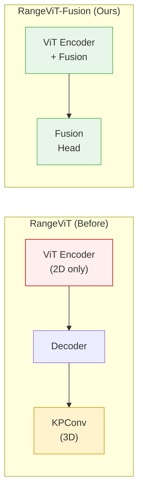

**Table - Contribution Summary:**

| Aspect | RangeViT | HARP-NeXt | **Ours** |
|--------|----------|-----------|----------|
| Pixel Branch | ViT | ConvNeXt | **ViT** |
| Point Branch | None | MLP layers | **MLP layers** |
| Fusion | None (post-hoc) | Continuous | **Continuous** |
| 3D Refiner | KPConv | None | **None** |
| Pretrained | ImageNet ViT | ImageNet CNN | **ImageNet ViT** |

**Talking Points:**
> "Our contribution is combining the best of both worlds. We take RangeViT's powerful ViT encoder with ImageNet pretraining, and inject HARP-NeXt's bidirectional fusion mechanism directly into it. Instead of processing purely in 2D and fixing it later with KPConv, our encoder maintains 3D awareness throughout. We add fusion operations at blocks 4, 8, and 12 - giving the model opportunities to exchange information at early, middle, and late stages. This lets us remove KPConv entirely while potentially achieving better results."

---

## Slide 6: Architecture Overview

**Slide Title:** RangeViT-Fusion Architecture

**Key Points:**
- **Input:** Range image (B, 5, H, W) + Point attributes (N, 5)
- **FeaturesEncoder:** MLP encodes point attributes to D-dimensional features
- **VisionTransformerFusion:** ViT with fusion at blocks 4, 8, 12
- **FusionHead:** Combines final pixel & point features for prediction
- **Losses:** Focal + Lovász on points, auxiliary CE on pixels

**Diagram - Full Architecture:**

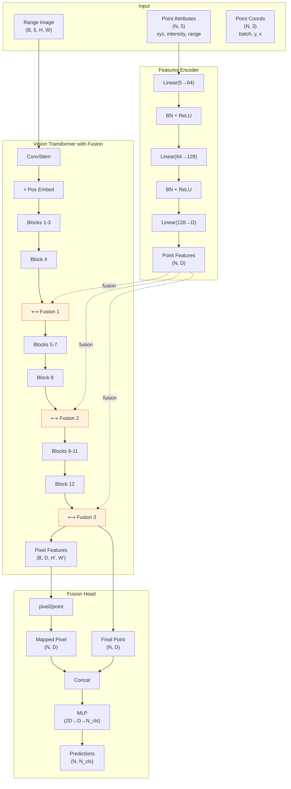

**Talking Points:**
> "Here's the complete architecture. Raw point attributes - xyz coordinates, intensity, and range - go through a FeaturesEncoder MLP to produce D-dimensional point features. The range image goes through our modified ViT. At blocks 4, 8, and 12, we pause the transformer and perform bidirectional fusion with the point branch. After the final fusion, we map the pixel features to point locations, concatenate with the final point features, and pass through the FusionHead MLP to get per-point predictions. We supervise with Focal and Lovász losses on points, plus auxiliary cross-entropy on pixels at each fusion point."

---

## Slide 7: Fusion Mechanism Detail

**Slide Title:** Bidirectional Fusion at Each Block

**Key Points:**
- **EfficientTransformationPipeline:** Handles all coordinate mappings
- **pixel2point:** Gather pixel features at point coordinates
- **point2cluster:** Max-pool points into voxel grid
- **cluster2pixel:** Scatter voxel features to dense pixel grid
- **Fusion layers:** Lightweight concat + linear/conv

**Diagram - Detailed Fusion Operation:**

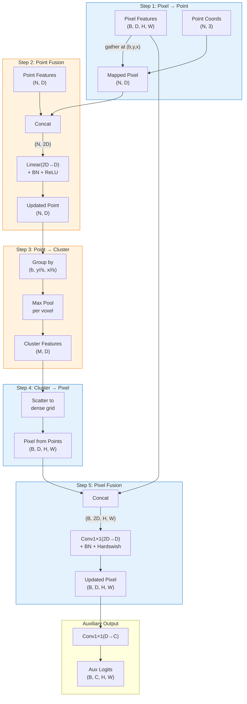

**Talking Points:**
> "Let me walk through one fusion operation in detail. First, we gather pixel features at each point's projected coordinates - this is a simple indexing operation. Then we concatenate these with point features and pass through an MLP - this is the point fusion. Next, we need to go back to pixel space. We group points by their pixel locations and max-pool within each group to get cluster features. These sparse clusters are scattered to a dense grid. Finally, we concatenate this with the original pixel features and apply a 1x1 conv - the pixel fusion. We also output auxiliary logits for intermediate supervision. This entire operation adds minimal compute but creates rich bidirectional information flow."

---

## Slide 8: Implementation Details

**Slide Title:** Technical Choices & Configuration

**Key Points:**
- **Backbone:** ViT-Small (22M params) or ViT-Base (86M params)
- **Fusion blocks:** [4, 8, 12] - early, mid, late fusion
- **Point encoding:** 5 → 64 → 128 → D (same as HARP-NeXt)
- **Loss weights:** Focal(γ=2) + Lovász + 0.4 × Auxiliary CE
- **Dynamic grid:** Handles variable image sizes (train windows vs full validation)

**Table - Model Configurations:**

| Config | Backbone | d_model | Params | Dataset |
|--------|----------|---------|--------|---------|
| Small | ViT-S/16 | 384 | ~25M | nuScenes |
| Base | ViT-B/16 | 768 | ~100M | SemanticKITTI |

**Table - Key Hyperparameters:**

| Parameter | Value | Rationale |
|-----------|-------|-----------|
| Fusion blocks | [4, 8, 12] | Early/mid/late feature exchange |
| Aux loss weight | 0.4 | Balance point vs pixel supervision |
| Focal gamma | 2.0 | Handle class imbalance |
| Patch stride | [2, 8] | Match RangeViT settings |
| Learning rate | 4e-4 | Standard for ViT fine-tuning |

**Diagram - Loss Computation:**

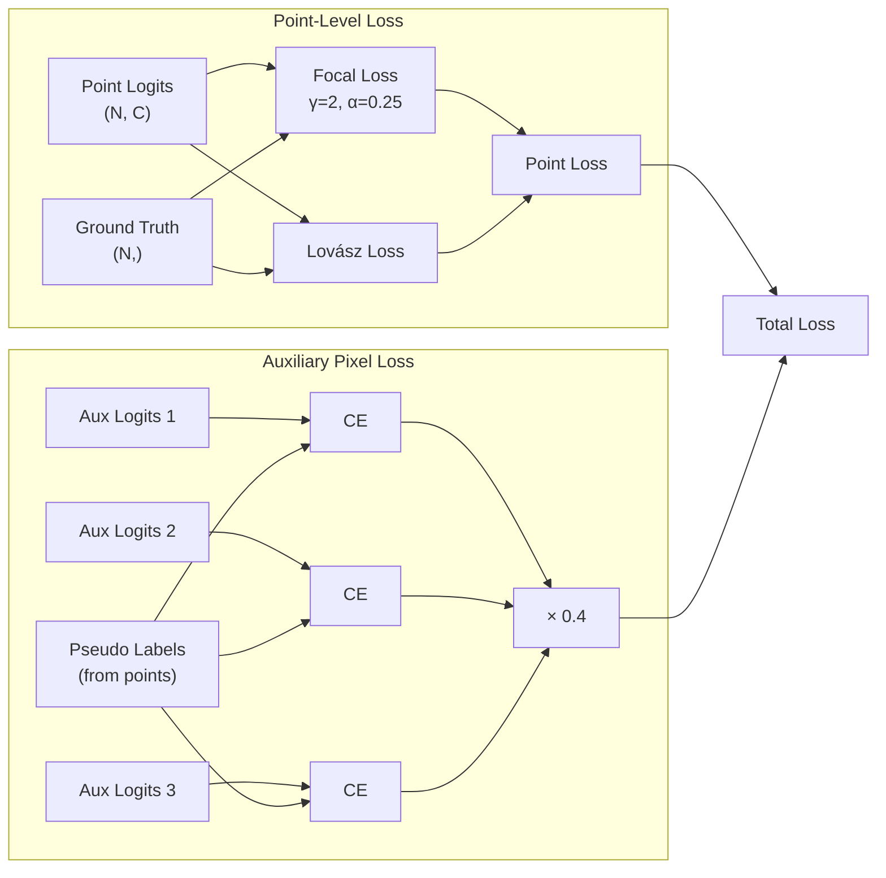

**Talking Points:**
> "For implementation, we support both ViT-Small for faster experiments and ViT-Base for maximum performance. Fusion happens at blocks 4, 8, and 12 - we found this spacing gives good coverage of early, mid, and late features. For losses, we use Focal loss to handle the severe class imbalance in LiDAR data, plus Lovász loss which directly optimizes IoU. Auxiliary losses at each fusion point provide intermediate supervision. One technical detail: we compute grid sizes dynamically from input dimensions, so the same model handles both training windows and full validation images without issues."

---

## Slide 9: Current Progress

**Slide Title:** Implementation Status

**Key Points:**
- ✅ Full architecture implemented and tested
- ✅ FeaturesEncoder, VisionTransformerFusion, FusionHead
- ✅ EfficientTransformationPipeline for coordinate mappings
- ✅ Focal + Lovász + Auxiliary losses
- ✅ Config files for nuScenes and SemanticKITTI
- ✅ Integration with existing training pipeline
- 🔄 Currently training on SemanticKITTI

**Diagram - Implementation Components:**

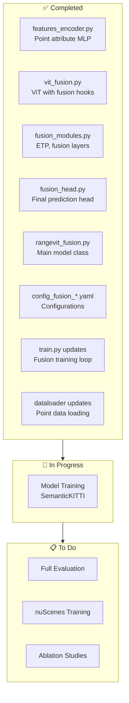

**Table - Files Created/Modified:**

| File | Status | Description |
|------|--------|-------------|
| `models/features_encoder.py` | ✅ New | Point attribute encoder |
| `models/vit_fusion.py` | ✅ New | ViT with fusion |
| `models/fusion_modules.py` | ✅ New | ETP, fusion layers |
| `models/fusion_head.py` | ✅ New | Prediction head |
| `models/rangevit_fusion.py` | ✅ New | Main model |
| `config_fusion_nusc.yaml` | ✅ New | nuScenes config |
| `config_fusion_kitti.yaml` | ✅ New | KITTI config |
| `train.py` | ✅ Modified | Fusion training loop |
| `dataset/range_view_loader.py` | ✅ Modified | Point data loading |

**Talking Points:**
> "On the implementation side, we've completed all core components. The FeaturesEncoder handles point attributes, VisionTransformerFusion implements the modified ViT with fusion hooks, and the FusionHead produces final predictions. We've created configs for both datasets and integrated everything with the existing training pipeline. The model is currently training on SemanticKITTI with ViT-Base backbone."

---

## Slide 10: Preliminary Results

**Slide Title:** Training Progress & Early Observations

**Key Points:**
- Training currently running on SemanticKITTI
- Monitoring: loss curves, mIoU, per-class IoU
- Parameter count verified: ~25M (Small) / ~100M (Base)
- No convergence issues observed
- [Add actual numbers when available]

**Diagram - Expected Metrics to Report:**

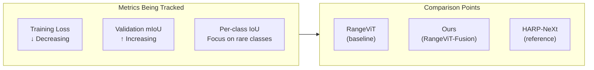

**Placeholder for Actual Results:**

| Model | mIoU (val) | car | bicycle | person | road | building |
|-------|------------|-----|---------|--------|------|----------|
| RangeViT (paper) | 64.0 | - | - | - | - | - |
| HARP-NeXt (paper) | 67.5 | - | - | - | - | - |
| **Ours (current)** | TBD | TBD | TBD | TBD | TBD | TBD |

**Talking Points:**
> "The model is currently training, so I'll show the latest metrics. [Update with actual numbers]. We're tracking overall mIoU as well as per-class performance, particularly for challenging classes like bicycles and pedestrians where 3D context should help most. Our hypothesis is that continuous fusion will particularly improve these small, sparse object classes that suffer most from the 2D projection ambiguity."

---

## Slide 11: Next Steps

**Slide Title:** Remaining Work

**Key Points:**
- Complete SemanticKITTI training and evaluation
- Run nuScenes experiments
- Ablation studies:
  - Number of fusion points (1 vs 2 vs 3)
  - Fusion block positions
  - With/without auxiliary losses
- Compare against RangeViT and HARP-NeXt baselines
- Analyze per-class improvements
- Write thesis chapter on methodology and results

**Diagram - Remaining Experiments:**

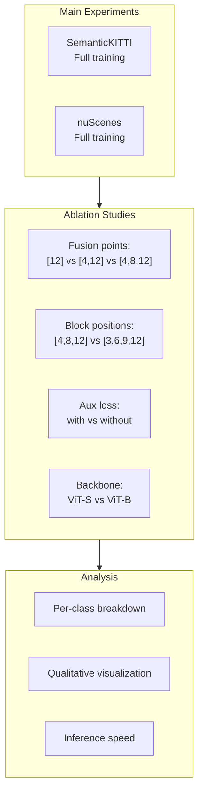

**Table - Proposed Ablation Studies:**

| Experiment | Variants | Purpose |
|------------|----------|---------|
| Fusion frequency | 1, 2, 3 fusion points | Find optimal fusion density |
| Fusion positions | Early vs late vs distributed | Where does fusion help most? |
| Auxiliary loss | 0, 0.2, 0.4, 0.6 weight | Importance of pixel supervision |
| Backbone size | ViT-S, ViT-B | Accuracy vs efficiency tradeoff |

**Talking Points:**
> "Moving forward, I'll complete the SemanticKITTI experiments and run the same setup on nuScenes. Then I'll conduct ablation studies to understand which design choices matter most - how many fusion points we need, where they should be placed, and how important the auxiliary pixel losses are. I'll also compare inference speed against KPConv-based approaches to quantify the efficiency gains. Finally, I'll do per-class analysis to verify our hypothesis that fusion particularly helps small object classes."

---

## Summary: Key Takeaways

1. **Problem:** RangeViT's 2D-only processing loses 3D geometric context
2. **Solution:** Integrate HARP-NeXt's bidirectional fusion INTO the ViT encoder
3. **Innovation:** First work combining ViT backbone with continuous point-pixel fusion
4. **Progress:** Full implementation complete, currently training
5. **Expected outcome:** Better accuracy without expensive KPConv post-processing
