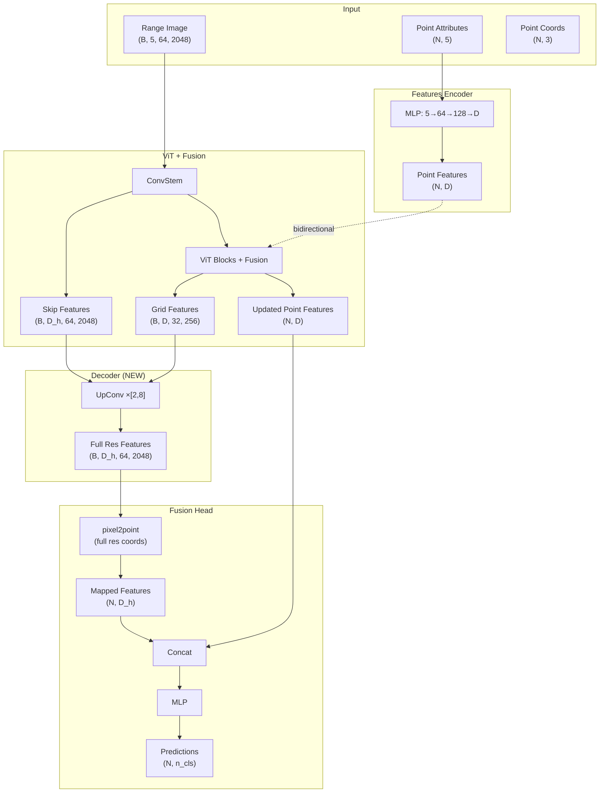

# RangeViT-Fusion Decoder Integration Design

## Goal

Add `DecoderUpConv` to RangeViT-Fusion to improve mIoU from 55% to beat 64%.

## Architecture



## Key Design Decisions

1. **Decoder refines pixel features** → then FusionHead predicts points
2. **Use skip connections** from ConvStem (D_h dimension)
3. **Full resolution mapping** - map features to points at 64×2048, not grid resolution
4. **Point losses only** - Focal + Lovász, no auxiliary pixel losses
5. **D_h configurable** - use 256 for richer features

## Component Changes

### RangeViTFusion

```python
self.decoder = DecoderUpConv(
    n_cls=n_cls,
    patch_size=patch_size,
    d_encoder=d_model,        # 384/768 from ViT
    d_decoder=D_h,            # From config (256)
    scale_factor=patch_stride,
    skip_filters=D_h,
)

self.fusion_head = FusionHead(
    d_pixel=D_h,              # From decoder
    d_point=d_model,          # From ViT
    n_classes=n_cls,
)
```

### FusionHead

Updated to handle different dimensions:
- d_pixel: D_h from decoder (256)
- d_point: d_model from ViT (384/768)
- concat_dim = d_pixel + d_point

### Config

```yaml
decoder: "up_conv"
D_h: 256
skip_filters: 256
fusion:
  aux_loss_weight: 0.0  # Disabled
```

## Forward Flow

1. `point_feats = features_encoder(point_attrs)`
2. `pixel_feats, point_feats, skip = vit_fusion(images, point_feats, coords)`
3. `full_res_feats = decoder(pixel_feats, skip, return_features=True)`
4. `mapped_feats = pixel2point(full_res_feats, full_res_coords)`
5. `logits = fusion_head(mapped_feats, point_feats)`
6. `loss = focal(logits, labels) + lovasz(logits, labels)`
